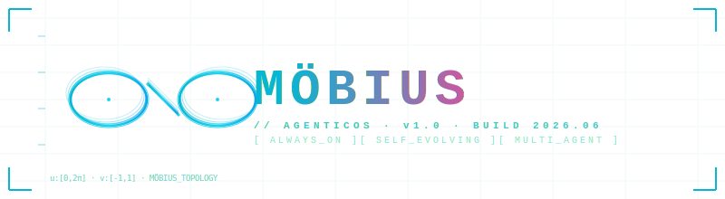

<div align="center">



<br/>


<br/>

<p>
  <a href="https://mobius.nutshellai.cn/"></a>
  
  
  
</p>

</div>

```
┌── MÖBIUS.AGENTICOS ─────────────────────────────────────────────┐
│  topology    : Möbius(half_twist=True)                          │
│  sides       : 1                                                 │
│  control_loop: perceive → plan → execute → reflect → evolve ↻    │
│  status      : RUNNING                                           │
└──────────────────────────────────────────────────────────────────┘
```

> 🛰 **ENGINE SPEC**: GLM-5.2 × MÖBIUS = OPEN_OPUS  
> Code Arena Global #1 · SWE-Bench Pro 62.1% · 1M Token Real Context  
> First Web workstation to fully drive Agent Sessions via GLM-5.2 (Z.AI-compatible interface)

---

## ◆ SPEC // OVERVIEW

Mobius is an enterprise-grade AgenticOS for real project collaboration. Projects, tasks, sessions, context, history — unified into one workstation where agents ship, verify, deliver, iterate inside your code and business environments.

Most agents stop at the conversation. Mobius reabsorbs code, knowledge, Memory, Skill, Extension, and research outcomes **back** into system capability. It builds products for you, and uses those products to rebuild itself.

```
  ┌── LOOP ────────────────────────────────────────────┐
  │  OLD: perceive → plan → execute → END               │
  │  NEW: perceive → plan → execute → evolve ↻          │
  └─────────────────────────────────────────────────────┘
```

| ◆ **ALWAYS_ON** | ◆ **SELF_EVOLVING** | ◆ **INCUBATING** |
|:---:|:---:|:---:|
| 7×24 持续运行 | 三层自进化 | 代码/工具/产品沉淀 |
| 多项目并行 | 重塑系统本身 | 可追溯的科研成果 |

---

## ◆ SPEC // USE_CASES

### `[01]` SOLO_DEV / ONE_PERSON_COMPANY
Parallel tracks via natural-language decomposition. Multiple Agent Sessions execute in isolated workspaces. **aimux** remote compute for heavy lifting. Confirm only at milestones.

### `[02]` FAST_PRODUCT_DEV
Requirement → runnable product, all in Web UI. Bundled modules:

| MODULE | OUTPUT |
|---|---|
| `ppt_gen` | NL → presentation slides |
| `news_wall` | Real-time finance news viz |
| `json_viz` | Interactive JSON browser |
| `physics_3d` | 3D physics simulation |

### `[03]` MULTI_AGENT_RESEARCH
Research mode → agent team:
```
Chief_Researcher ─┬─▶ Assistant[0] ─┐
                  ├─▶ Assistant[1] ─┼─▶ research_graph
                  └─▶ Assistant[2] ─┘
```
Shared blackboard async alignment. Auto-aggregation into visual research graph.

---

## ◆ SPEC // CAPABILITIES

<details>
<summary><b>[01] ALWAYS_ON — 让智能体以周为单位持续推进项目</b></summary>

Long-horizon = agents truly enter a project and keep working. Project → Issue → Session + run records.

- Multi-project day-and-night progress.
- Full message/status/result/failure logging.
- Stall detection + whipping mechanism.
- Take over or accept anytime.

</details>

<details>
<summary><b>[02] SELF_EVOLVING — 完成任务的同时重塑系统</b></summary>

```
evolve_layers:
  - user_driven      // user requests → dev cycle
  - info_driven      // web/docs/history augmentation  
  - cognitive_driven // system-proposed improvements
```

Mobius itself = project `imac-self-develop`. Platform improvements flow through same Issue / Session pipeline.

</details>

<details>
<summary><b>[03] TEAM_WORKFLOW</b></summary>

- Context auto-injection at Session snapshot.
- Structured handoff to next agent or member.
- Parallel isolation in separate workspaces.
- Centralized permission & audit.

</details>

<details>
<summary><b>[04] MULTI_AGENT</b></summary>

tmux Agent runtime hosting Codex / Claude Code. Whipping mechanism detects stalls. Research scenarios: decompose → parallel retrieve → converge → research graph.

</details>

<details>
<summary><b>[05] COMPUTE_FLEET</b></summary>

**aimux** node management. Mass data, batch regression, simulation, parallel R&D. Compute = dynamic resource organized around tasks.

</details>

<details>
<summary><b>[06] HUMAN_FRIENDLY</b></summary>

XiaoMo reads page state. For ambiguous requests, proposes candidates first. Web + desktop + mobile convergence.

</details>

<details>
<summary><b>[07] PRODUCT_INCUBATION</b></summary>

Outputs = real assets: pages, tools, apps, research graphs, Skills, Memories, Extensions. Independent frontends, isolated backends, unified governance.

</details>

---

## ◆ SPEC // TOPOLOGY

```
  ┌─────────┐     ┌─────────┐     ┌─────────┐
  │ PROJECT │ ──▶ │  ISSUE  │ ──▶ │ SESSION │
  │ context │     │  goal & │     │  real   │
  │container│     │ accept  │     │  exec   │
  └─────────┘     └─────────┘     └─────────┘
       ▲                                │
       │      ┌──────────────┐          │
       └──────│  evolve()    │◀─────────┘
              └──────────────┘
```

> **◆ SNAPSHOT_GUARANTEE**: Session creation freezes Issue + context + Skill + Memory. No drift on subsequent global changes.

| **Memory** | **Skill** | **Research** |
|:---:|:---:|:---:|
| Env info | Reusable craft | Multi-stage |
| SSH, keys | Dev specs | Chief + Assistant |

---

## ◆ SPEC // ASSISTANT

> **XiaoMo** — global floating assistant. One persistent user-level Agent Session per user.

```
xiaomo.spec:
  capabilities:
    - READ_PAGE
    - SEARCH_PROJECTS
    - CREATE_PROJECT_ISSUE_SESSION
    - CLARIFY_WITH_CANDIDATES
    - SELF_SHAPING
  boundary:
    - "Won't auto-start business agents. User confirmation required."
```

<details>
<summary><b>[TOUR_SYSTEM] 3 demo routes</b></summary>

```
tour_routes:
  - id: birthday_invite
    auto_trigger: first_login
    status: WIRED
  - id: import_project
    example: TodoMVC
    status: STATE_ONLY_NO_UI_ENTRY
  - id: context_config
    example: Memory/Skill/aimux
    status: STATE_ONLY_NO_UI_ENTRY
```

</details>

---

## ◆ SPEC // QUICKSTART

### `[A]` CONTAINER (RECOMMENDED)

```bash
git clone https://github.com/nutshellai-tech/mobius.git && cd mobius
docker build -t imac-mobius-base:latest -f deploy/Dockerfile .
docker build -t imac-mobius-exe:latest .
docker compose up
```

### `[B]` LOCAL_DEV

```bash
git clone https://github.com/nutshellai-tech/mobius.git
cd mobius && cp .env.example .env

cd mobius
IMAC_BOOTSTRAP_USERS="admin:your-password:admin:Administrator" \
  DB_PATH=<data>/mobius.db WORKSPACE_ROOT=<data>/workspace \
  node scripts/bootstrap-users.js

cd .. && python3 start.py --detach
```

| SERVICE | PORT |
|---|---|
| frontend | `45616` |
| backend | `45614` |
| aimux | `45615` |
| vscode_web | `45617` |

---

## ◆ SPEC // ROADMAP

```
roadmap_status:
  - id: xiaomo_persistent_session
    status: OK
  - id: xiaomo_state_aware_backend
    status: OK
  - id: xiaomo_self_shaping
    status: OK
  - id: tour_system_3_routes
    status: OK
  - id: tour_explicit_ui_entry
    status: WARN
    note: "Only birthday demo auto-triggers"
  - id: research_extensions_in_overview
    status: TODO
```

---

## ◆ SPEC // LICENSE

> **◆ Source-Available license.** Learning / research / education / personal / internal-eval use OK. Commercial use requires authorization. See [LICENSE](https://github.com/nutshellai-tech/mobius/blob/main/LICENSE).

```
contact: business@nutshellai.cn
```

---

<div align="center">

```
┌────────────────────────────────────────────────┐
│  MÖBIUS.SPEC // END_OF_DOCUMENT                │
│  What you see is what you get.                  │
│  What you imagine can grow.                     │
│  → mobius.nutshellai.cn                         │
└────────────────────────────────────────────────┘
```

</div>
